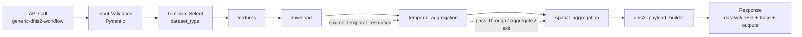
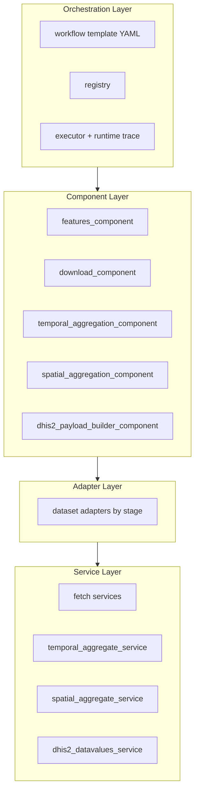
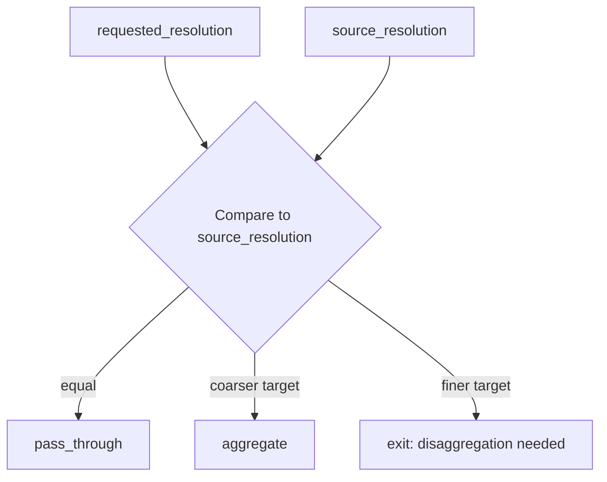

# Generic Workflow Infographic + Talking Points

## 1) Infographic: End-to-End Flow

## 2) Infographic: Architecture Layers

## 3) Infographic: Temporal Decision Policy

## 4) Core Message (1 minute)

1. We now have one canonical workflow chain for all gridded datasets.
2. Components are single-purpose and ordered: features, download, temporal, spatial, payload.
3. Dataset differences are isolated in adapters and capability metadata, not in orchestration design.
4. Temporal behavior is policy-driven by source vs requested frequency.
5. Payload generation is normalized through a shared DHIS2 formatter.
6. Capability discovery is explicit: provider capability vs integration capability.

## 5) Talking Points (5-7 minutes)

### Slide A: Why this refactor

1. Before: each dataset workflow mixed orchestration and domain logic.
2. Now: strict separation:
   - orchestration decides *sequence*
   - components own *stage contracts*
   - adapters own *dataset-specific behavior*
   - services own *domain operations*
3. Result: easier extension to ERA5, CHIRPS3, WorldPop, and future datasets.

### Slide B: What is now stable

1. Fixed canonical chain:
   - `features -> download -> temporal_aggregation -> spatial_aggregation -> dhis2_payload_builder`
2. Uniform component contract:
   - `fn(params, context) -> dict`
3. Uniform control semantics:
   - `pass_through`, `aggregate`, `exit`
4. Uniform output model:
   - canonical rows (`orgUnit`, `period`, `value`) before DHIS2 formatting
5. Discoverability endpoint:
   - `GET /ogcapi/processes/generic-dhis2-workflow/capabilities`

### Slide C: Why this is future-proof

1. Fetch granularity is independent of output granularity.
   - Example: CHIRPS fetches monthly files, still outputs weekly/monthly aggregates.
2. Temporal policy is dataset-capability aware, not hardcoded by dataset name.
3. New dataset onboarding becomes adapter + capability work, not orchestration rewrite.
4. Provider potential can be tracked separately from current implementation readiness.

### Slide D: WorldPop clarification

1. `worldpop_fetch_service` now does fetch/sync only.
2. Aggregation responsibility is in aggregation services and stage adapters.
3. This keeps stage boundaries clean and aligns WorldPop with the same architecture principle as other datasets.

### Slide E: Current status

1. Architecture and naming are aligned.
2. Services are split into temporal vs spatial aggregation concerns.
3. Targeted lint/type/tests are passing.
4. Capability catalog now separates:
   - `provider_capabilities`
   - `integration_capabilities`

## 6) Suggested Close / Narrative

1. “We now have a generic workflow engine, not dataset-specific pipelines.”
2. “Each stage has one job, and every decision is explicit and traceable.”
3. “Next, we industrialize onboarding: dataset capability YAML + adapter registration.”

## 7) Presenter Cheat Sheet (Q&A)

### Q: Why not one giant service per dataset?

A: It hides stage boundaries and makes orchestration rigid. We need composable stage behavior.

### Q: Why not one generic aggregator with zero adapters?

A: Gridded datasets share patterns, but dimensions, nodata, and file semantics differ. Adapters keep those differences thin and explicit.

### Q: Can this support future WorldPop monthly/daily products?

A: Yes. Update provider/integration capability metadata and adapter mapping; orchestration chain remains unchanged.
